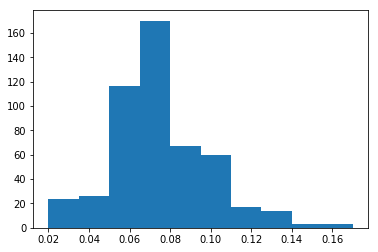
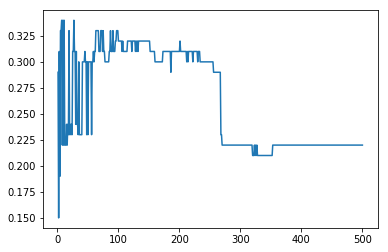
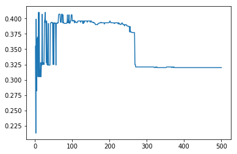

大家好，这篇是有关台大机器学习课程作业七的详解。

我的github地址：  
https://github.com/Doraemonzzz

个人主页：  
http://doraemonzzz.com/

作业地址:  
https://www.csie.ntu.edu.tw/~htlin/course/ml15fall/

参考资料:  
https://blog.csdn.net/a1015553840/article/details/51085129  
http://www.vynguyen.net/category/study/machine-learning/page/6/  
http://book.caltech.edu/bookforum/index.php  
http://beader.me/mlnotebook/   
https://blog.csdn.net/qian1122221/article/details/50130093   
https://acecoooool.github.io/blog/


#### Problem 1

$$
\begin{aligned}
1- \mu_+^2-\mu_-^2
&=1- \mu_+^2-(1-\mu_+)^2\\
&=1- \mu_+^2- \mu_+^2+2 \mu_+-1\\
&=-2\mu_+^2+2 \mu_+\\
&=-2(\mu_+-\frac 1 2)^2+\frac 1 2
\end{aligned}
$$

因为$\mu_+\in [0,1]$，所以$1- \mu_+^2-\mu_-^2 \in [0,\frac 1 2]$，最大值为$\frac 1 2 $


#### Problem 2

$$
\begin{aligned}
\mu_+(1 − (\mu_+ − \mu_−))^2 + \mu_−(−1 − (\mu_+ − \mu_−))^2
&=\mu_+[1-2(\mu_+ − \mu_−)+(\mu_+ − \mu_−)^2]+
\mu_−[1+2(\mu_+ − \mu_−)+(\mu_+ − \mu_−)^2]\\
&=\mu_+ +\mu_-+(\mu_+ + \mu_−)(\mu_+ − \mu_−)^2-2(\mu_+ − \mu_−)(\mu_+ − \mu_−)\\
&=1+(\mu_+ − \mu_−)^2-2(\mu_+ − \mu_−)^2\\
&=1-(\mu_+ − \mu_−)^2\\
&=1-(2\mu_+-1)^2\\
&=4\mu_+-4\mu_+^2
\end{aligned}
$$

根据Problem 1以及正规化错误的定义可知
$$
\text{normalized Gini index}=(-2\mu_+^2+2 \mu_+)/(\frac 1 2)=4\mu_+-4\mu_+^2
$$
所以
$$
\text{normalized Gini index}=\text{normalized squared regression 
error}
$$


#### Problem 3

回顾课件可知，一个数据不被选择的概率为
$$
(1-\frac{1}{N})^{N^{'}}=(1-\frac{1}{N})^{pN}=[(1-\frac{1}{N})^{N}]^p\approx e^{-p}
$$
因为一共有$N$组数据，所以没有被选择的数据数量大概为
$$
e^{-p}N
$$


#### Problem 4

根据下一题可知
$$
E_{out}(G)\le \frac 2{3+1}( 0.15+0.25+0.35)=0.375
$$
显然
$$
E_{out}(G)\ge0
$$
所以
$$
E_{out}(G)\in [0,0.375)
$$


#### Problem 5

根据Random Forest的算法，我们知道如果要把一个点误分，那么$K$个$\text{binary classification trees}$中必然至少要$\frac{K+1}{2}$个分类器犯错，我们知道一共有$\sum_{k=1} ^Ke_k$个错误，所以$E_{out}(G)$最多为
$$
\sum_{k=1} ^Ke_k/\frac{K+1}{2}=\frac{2}{K+1}\sum_{k=1} ^Ke_k
$$


#### Problem 6

计算公式为
$$
U_{t+1}=2U_t\sqrt{\epsilon_t(1-\epsilon_t)}
$$
具体的推导过程可以看作业6的22题，这里直接带入
$$
U_3=2U_2\sqrt{\epsilon_2(1-\epsilon_2)}=4U_1\sqrt{\epsilon_2(1-\epsilon_2)}\sqrt{\epsilon_1(1-\epsilon_1)}
$$
注意$(u_1,...,u_N)=(\frac 1N,...,\frac 1N)$，所以$U_1=1$
$$
U_3=2U_2\sqrt{\epsilon_2(1-\epsilon_2)}=4U_1\sqrt{\epsilon_2(1-\epsilon_2)}\sqrt{\epsilon_1(1-\epsilon_1)}=4\sqrt{\epsilon_2(1-\epsilon_2)}\sqrt{\epsilon_1(1-\epsilon_1)}
$$


#### Problem 7

结合题目以及课件17页可知
$$
\eta为使得\frac1N \sum_{n=1}^N\Big((y_n − s_n) − ηg_1(x_n)\Big)^2最小的值
$$
对上式关于$\eta​$求偏导可得
$$
-\frac{2}N \sum_{n=1}^Ng_1(x_n)\Big((y_n − s_n) − ηg_1(x_n)\Big)=0
$$
此处$g_1(x_n)=2,s_n=0$带入可得
$$
\sum_{n=1}^{N}2\Big((y_n − 0) − 2η\Big)=0\\
\eta =\frac{1}{2N}\sum_{n=1}^Ny_n
$$
由于更新规则为$\alpha_1=\eta$，$s_n=\alpha_1g_1(x_n)$，所以
$$
s_n=\alpha_1g_1(x_n)=\frac{1}{2N}\sum_{n=1}^Ny_n\times 2=\frac 1N\sum_{n=1}^Ny_n
$$


#### Problem 8

回顾课件19页可知
$$
\alpha_t =\eta =\frac{\sum_{n=1}^N g_t(x_n)(y_n − s_n)} { \sum_{n=1}^N g_t^2(x_n)}\\
{\sum_{n=1}^N g_t(x_n)(y_n − s_n)} =\alpha_t { \sum_{n=1}^N g_t^2(x_n)}\\
{\sum_{n=1}^N g_t(x_n)s_n}={\sum_{n=1}^N g_t(x_n)y_n}-\alpha_t { \sum_{n=1}^N g_t^2(x_n)}
$$


#### Problem 9

OR运算的特点是只有当每个值都为False，结果才为False，结合这个特点可以取
$$
w_0=d-\frac 1 2,w_i=1(i=1,...,d)
$$


#### Problem 10

由Problem 21，$D$的最小值为$5$，具体过程见Problem 21


#### Problem 11

初始的$w_{ij}^{(l)}$都为$0$，所以前向传播之后$s_j^{(l)}=0,(l=1,...,L)$

回顾反向传播的更新规则
$$
\frac{\partial e_n}{\partial w_{ij}^{(l)}}=\delta_j^{(l)}\Big(x_i^{(l-1)}\Big)\\ 
\delta_j^{(L)}=-2\Big(y_n-s_j^{(L)}\Big)\\ 
\delta_j^{(l)}=\sum_k\Big(\delta_k^{(\mathcal l+1)}\Big)\Big(w_{jk}^{(l+1)}\Big)\Big(\text{tanh}^\prime(s_j^{(l)})(l=0,...,L-1)
$$
所以根据上式，
$$
\delta_j^{(l)}=0,(l=0,...,L-1)
$$
因为原始的$w_{ij}^{(l)}​$都为0，所以根据更新规则
$$
w_{ij}^{(l)} =w_{ij}^{(l)}− η\delta_j^{(l)}x_i^{(l-1)}
$$
可知
$$
w_{ij}^{(l)}=0(l=0,...,L-1)
$$


#### Problem 12

初始的$w_{ij}^{(l)}$都为$1$，假设输入为$x_1,...,x_d$，偏移项为$x_0=1$，那么
$$
s_i^{(1)}=\sum_{i=0}^{d}w_{ij}^{(l)}x_i=\sum_{i=0}^dx_i
$$
说明第一个隐藏层的$s_i^{(1)}$都相等，根据递推公式
$$
x_i^{(l-1)}=\text{tanh}(s_i^{(l)})\\
s_i^{(l)}=\sum_{i=0}^{d^{(l-1)}}w_{ij}^{(l)}x_i^{(l-1)}
$$
我们知道每个隐藏层的$s_i^{(l)},x_i^{(l)}$都相等，从而$\delta_j^{(L)}=-2\Big(y_n-s_j^{(L)}\Big)$都相等，根据反向传播的更新公式
$$
\delta_j^{(l)}=\sum_k\Big(\delta_k^{(\mathcal l+1)}\Big)\Big(w_{jk}^{(l+1)}\Big)\Big(\text{tanh}^\prime(s_j^{(l)})\Big)
$$
可得，对于固定的$l$，$\delta_j^{(l)}$都相等，特别的，第一层的$\delta_j^{(1)}$都相等，根据更新规则
$$
w_{ij}^{(1)} =w_{ij}^{(1)}− η\delta_j^{(1)}x_i^{(0)}
$$
以及初始的$w_{ij}^{(l)}$都为$1$可得
$$
w_{ij}^{(1)}=w_{i(j+1)}^{(1)}
$$


#### Problem 13

略过


#### Problem 14

```python
import numpy as np
import matplotlib.pyplot as plt

#构造类
class DTree:
    def __init__(self, node, theta, d, left, right):
        self.node = node
        #阈值
        self.theta = theta
        #维度
        self.d = d
        self.left = left
        self.right = right
    
    #判断是否都为一类
    def ispure(self):
        num = np.sum(self.node[:, 2] == 1)
        return num == 0 or num == len(self.node)

#读取数据
def readdata(file):
    Data = []
    with open(file) as data:
        for i in data.readlines():
            i.strip()
            Data.append(list(map(float,i.split())))
    return np.array(Data)
```

读取数据并作图。


```python
train = readdata('hw7_train.dat')
test = readdata('hw7_test.dat')

#作图
plt.scatter(train[:, 0][train[:, 2] == -1], train[:, 1][train[:, 2] == -1])
plt.scatter(train[:, 0][train[:, 2] == 1], train[:, 1][train[:, 2] == 1])
plt.show()
```


定义Gini index


```python
def Gini(y):
    N = len(y)
    if(N == 0):
        return 1
    t = np.sum(y == -1)/ N
    return 1 - t**2 - (1 - t)**2
```

定义impurty


```python
def lossfunc(theta, data, d):
    '''
    d为数据的维度，theta为decision stump的阈值
    '''
    index1 = (data[:, d] < theta)
    index2 = (data[:, d] >= theta)
    Gini1 = Gini(data[index1][:, 2])
    Gini2 = Gini(data[index2][:, 2])
    return len(index1) * Gini1 + len(index2) * Gini2
```

在两个维度上分别利用decision stump计算，找到损失函数的最小值，返回维度以及阈值


```python
def branch(data):
    '''
    在两个维度上分别利用decision stump计算，找到损失函数的最小值，返回维度以及阈值
    '''
    train = data
    #记录最优阈值以及损失函数的最小值以及维度
    theta = 0
    error = 10000
    d = 0
    
    #根据第一个维度
    train = np.array(sorted(train, key = lambda x: x[0]))
    #计算decision stump的阈值
    segmentx = train[:, 0]
    #
    for i in segmentx:
        error1 = lossfunc(i, train, 0)
        if error1 < error:
            error = error1
            theta = i

    #根据第二个维度排序
    train = np.array(sorted(train, key = lambda x: x[1]))
    #计算decision stump的阈值
    segmenty = train[:, 1]
    for i in segmenty:
        error2 = lossfunc(i, train, 1)
        if error2 < error:
            error = error2
            theta = i
            d = 1
    return theta, d
```

构造学习函数


```python
def isstop(data):
    '''
    判断是否停止，有两种情形，一种是没有数据，另一种是所有数据都为一类
    '''
    n = len(data)
    num = np.sum(data[:, 2] == -1)
    return num == n or num == 0

def learntree(data):
    if isstop(data):
        return DTree(data[0][2], 0, 0, None, None)
    else:
        theta, d = branch(data)
        tree = DTree(None, theta, d, None, None)
        #划分数据
        leftdata = data[data[:, d] < theta]
        rightdata = data[data[:, d] >= theta]
        #学习左树
        leftTree = learntree(leftdata)
        #学习右树
        rightTree = learntree(rightdata)
        #返回
        tree.left = leftTree
        tree.right = rightTree
        return tree
```

预测函数


```python
def pred(tree, data):
    if tree.left == None and tree.right == None:
        return tree.node
    if data[tree.d] < tree.theta:
        return pred(tree.left, data)
    else:
        return pred(tree.right, data)
```

计算误差


```python
def error(Dtree, data):
    ypred = [pred(Dtree, i) for i in data]
    return 1 - np.sum(ypred == data[:, 2]) / len(data)
```

训练数据


```python
dtree = learntree(train)
```


```python
error(dtree, train)
```


    


#### Problem 15

```python
error(dtree, test)
```


    0.14800000000000002


#### Problem 16

求出30000棵树对应的$E_{in}(g_t)$，为了减少运算量，这里取500棵。


```python
N = 500
Ein = np.array([])
tree = []
m, n = train.shape
for i in range(N):
    index = np.random.randint(0, m, (m))
    traindata = train[index, :]
    dtree = learntree(traindata)
    tree.append(dtree)
    Ein = np.append(Ein, error(dtree, train))
    
plt.hist(Ein)
plt.show()
```





#### Problem 17

每次取前$t$棵数构成随机森林，计算结果并作图。

```python
def random_forest_error(tree, data):
    '''
    利用前k个树计算结果
    '''
    Error = np.array([])
    N = len(tree)
    for i in range(N):
        E = []
        for j in range(1+i):
            #E = np.append(E, error(tree[j], train))
            E.append([pred(tree[j], k) for k in data])
        E = np.array(E)
        #0视为1
        ypred = np.sign(E.sum(axis = 0) + 0.5)
        error = 1 - np.sum(ypred == data[:, 2]) / len(data)
        Error = np.append(Error, error)
    return Error

Ein_G = random_forest_error(tree, train)
```

作图


```python
plt.plot(np.arange(1, N+1), Ein_G)
plt.show()
```


#### Problem 18

```python
Eout_G = random_forest_error(tree, test)
```

作图


```python
plt.plot(np.arange(1, N+1), Eout_G)
plt.show()
```


#### Problem 19

依旧取前$t$棵数构成随机森林，但是没棵树只有一个branch，即每棵树对应了二元分类。

```python
def learntree_new(data):
    theta, d = branch(data)
    tree = DTree(None, theta, d, None, None)
    #划分数据
    leftdata = data[data[:, d] < theta]
    rightdata = data[data[:, d] >= theta]
    #左树
    k1 = np.sign(np.sum(leftdata[:, 2]) + 0.5)#+0.5是为了防止出现0
    leftTree = DTree(k1, None, None, None, None)
    #右树
    k2 = np.sign(np.sum(rightdata[:, 2]) + 0.5)
    rightTree = DTree(k2, None, None, None, None)
    #返回
    tree.left = leftTree
    tree.right = rightTree
    return tree
```


```python
N = 500
newtree = []
m, n = train.shape
for i in range(N):
    index = np.random.randint(0, m, (m))
    traindata = train[index, :]
    dtree = learntree_new(traindata)
    newtree.append(dtree)
```


```python
newEin_G = random_forest_error(newtree, train)
```

作图


```python
plt.plot(np.arange(1, N+1), newEin_G)
plt.show()
```





#### Problem 20

```python
newEout_G = random_forest_error(newtree, test)
```


```python
plt.plot(np.arange(1, N+1), newEout_G)
plt.show()
```





#### Problem 21

由之前讨论可以知道，我们可以利用$\text{sign}(s)$表示$\text{NOT,AND,OR}$逻辑，从而第一层可以表示如下逻辑关系
$$
\prod _{i=d_1}^{d_n} x_i^{t},x_i^{t}\in \{x_i,\overline x_i\}(1\le d_1\le ...\le d_n \le d)\\
$$
第二层我们利用这种逻辑关系来表达$\text{XOR}\Big(x_1, x_2,...,x_d\Big)​$，给出以下命题

命题：
$$
记x_1,...,x_d为d个逻辑单元，\\
z_j =\prod _{i=d_1}^{d_{a_j}} x_i^{t},x_i^{t}\in \{x_i,\overline x_i\}(1\le d_1\le ...\le d_{a_j} \le d)\\
f_{m}=\sum_{j=1}^{m}z_j^t,其中z_j^t \in \{z_j ,\overline z_j\} \\
那么存在f_{d}=\text{XOR}\Big(x_1, x_2,...,x_d\Big)，且d为表达异或逻辑的神经元数量的最小值\\
$$
证明：

关于$d$利用数学归纳法。

这里的基础情况为$d=2$，因为$1$个逻辑单元无法表示异或逻辑，回顾课件可知
$$
f_2=\overline x_{1}x_2+ x_{1}\overline x_2
$$
可以表示异或逻辑，所以$d=2$时结论成立。

假设$d=k$时结论，现在证$d=k+1$时结论也成立。假设逻辑单元为$x_1,...,x_k,x_{k+1}$，根据归纳假设，存在
$$
f_{k}=\sum_{j=1}^{k}z_j^t,其中z_j^t \in \{z_j ,\overline z_j\}\\
z_j =\prod _{i=d_1}^{d_{a_j}} x_i^{t},x_i^{t}\in \{x_i,\overline x_i\}(1\le d_1\le ...\le d_{a_j} \le d)\\
f_{k}=\text{XOR}\Big(x_1,...,x_k\Big)\\
k表达异或逻辑的神经元数量的最小值
$$
根据异或的定义，有如下关系
$$
\text{XOR}\Big(x_1, x_2,...,x_k,x_{k+1}\Big)=\text{XOR}\Big(\text{XOR}\Big(x_1, ...,x_{d}\Big) ,x_{k+1}\Big)=\text{XOR}\Big(f_k,x_{k+1}\Big)
$$
因为$f_k$也为逻辑单元，所以表示$\text{XOR}\Big(f_k,x_{k+1}\Big)$至少需要关于$f_k,x_{k+1}$的$2$个逻辑单元，可以表示如下
$$
\text{XOR}\Big(f_k,x_{k+1}\Big)=\overline f_{k}x_{k+1}+ f_{k}\overline x_{k+1}
$$
根据逻辑运算规则，
$$
\overline {f_{k}}=\prod_{j=1}^{k}\overline z_j^t\\
z_j =\prod _{i=d_1}^{d_{a_j}} x_i^{t},x_i^{t}\in \{x_i,\overline x_i\}(1\le d_1\le ...\le d_{a_j} \le d)
$$
从而$\overline {f_{k}}$为一个逻辑单元，将$f_{k}=\sum_{j=1}^{k}z_j^t$一起带入可得
$$
\begin{aligned}
\text{XOR}\Big(x_1, x_2,...,x_k,x_{k+1}\Big)
&=\text{XOR}\Big(f_k,x_{k+1}\Big)\\
&=\overline f_{k}x_{k+1}+ f_{k}\overline x_{k+1}\\
&=x_{k+1}\prod_{j=1}^{k}\overline z_j^t +(\sum_{j=1}^{k}z_j^t)\overline x_{k+1}\\
\end{aligned}
$$
由逻辑学知识可知，$\text{NOT,AND}​$逻辑可以表达所有的逻辑，从而$x_{k+1}\prod_{j=1}^{k}\overline z_j^t,z_j^t\overline x_{k+1}​$可以表达为
$$
\prod_{i=1}^{d_{a_{j+1}}}\overline x_{i}^t 或\overline{\prod_{i=1}^{d_{a_{j+1}}}\overline x_{i}^t },其中x_i^{t}\in \{x_i,\overline x_i\}
$$
记$z_j ^{'}=\prod _{i=d_1}^{d_{a_{j+1}}} x_i^{t},x_i^{t}\in \{x_i,\overline x_i\}(1\le d_1\le ...\le d_{a_{j+1}}\ \le k+1)$，那么
$$
\text{XOR}\Big(x_1, x_2,...,x_k,x_{k+1}\Big)=\sum_{j=1}^{k+1}z_j ^{'t} 
\\其中z_j ^{'t} \in \{z_j ^{'},\overline z_j ^{'} \}
$$
所以结论对于$n=k+1$也成立，从而结论得证。


#### Problem 22

直接给出结论，最小值为
$$
1+[\log_2 n]
$$
方法很巧妙，可以参考以下两篇文献，主要是文献2，文献已经下载在文件夹中。

[Neural network computation with DNA strand displacement cascades ](https://www.nature.com/articles/nature10262.pdf)

[The Realization of Symmetric Switching Functions with Linear-Input Logical Elements](http://xueshu.baidu.com/s?wd=paperuri%3A%280f626625bff6ef7e45f42f92061ff9ca%29&filter=sc_long_sign&tn=SE_xueshusource_2kduw22v&sc_vurl=http%3A%2F%2Fieeexplore.ieee.org%2Fxpls%2Fabs_all.jsp%3Farnumber%3D5219224&ie=utf-8&sc_us=13123849583975524837)

